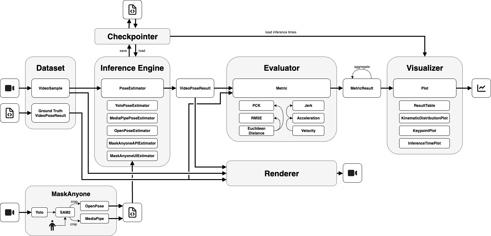

# MaskBench - A Comprehensive Benchmark Framework for 2D Pose Estimation and Video De-Identification

## Overview


MaskBench is a **flexible, modular benchmarking framework** for running, comparing, and visualizing 2D pose estimation models, with a focus on **privacy-preserving masked videos**.
It addresses a common challenge in research collaboration—sharing datasets with identifiable individuals—by enabling systematic analysis of how masking affects model performance.
The toolkit includes **seven built-in pose estimators** (Yolo, MediaPipe, and OpenPose) plus four variants of the [MaskAnyone](https://github.com/MaskAnyone/MaskAnyone) mixture-of-experts pipeline, which produce smoother poses, greatly improve stability, and reduce jitter compared to standalone models.
It supports **ground-truth metrics** (RMSE, PCK, Euclidean distance) and **kinematic metrics** (velocity, acceleration, jerk), along with rich visualizations to **assess both accuracy and temporal smoothness**.
Its **modular design** makes it easy to add new datasets, models, metrics, or visualizations for custom benchmarking workflows.
Whether you’re testing a new model, comparing existing ones, or studying the impact of masking strategies, MaskBench provides a clear, repeatable workflow to get the job done.

## 🛠️ Getting Started
### 🖥️ System Requirements

- 🐳 **Docker**: Latest stable version  
- 🎮 **GPU**: NVIDIA (CUDA-enabled)  
- 💾 **Memory**: 20 GB or more

### 📦 Installation

Follow the instructions below to install and run experiments with MaskBench:

1. **Install Docker** and ensure the daemon is running.
2. **Clone this repo**:
   ```bash
   git clone https://github.com/maskbench/maskbench.git
   ```
3. **Switch to the git repository**
    ```bash
    cd maskbench
    ```
4. **Setup the folder structure**. For a quick start, create a dataset folder with a name of your choice in the `assets/datasets/` folder. Create a `videos` folder inside and place one or more videos in it. For storing datasets, output or weights in different locations, see "Editing the .env file". Labels, maskanyone_ui_mediapipe and mask_anyone_ui_openpose folders are optional and not required for a quick start. The structure of a dataset is outlined below and also detailed in the "Usage - Dataset Structure" section:

    ```bash
    maskbench/
    ├── src
    ├── config/
    │   └── your-experiment-config.yml
    └── assets/
        ├── weights
        ├── output
        └── datasets/
            └── your-dataset-name/
                ├── videos/
                │   └── video_name1.mp4
                ├── labels/
                │   └── video_name1.json
                ├── maskanyone_ui_mediapipe/
                │   └── video_name1.json
                └── maskanyone_ui_openpose/
                    └── video_name1.json
    ```
5. **Create the environment file**. This file is used to tell MaskBench about your dataset, output and weights directory, as well as the configuration file to use for an experiment. Copy the .env file using:
    ```bash
    cp .env.dist .env
    ```
6. **Edit the .env file**. Open it using `vim .env` or `nano .env.`. Adjust the following variables:
    * `MASKBENCH_CONFIG_FILE:` The configuration file used to define your experiment setup. By default, it is set to `config/getting-started.yml`, but you can copy any of the provided configuration files to `config/` and edit it to your needs.
    * `MASKBENCH_GPU_ID:` If you are on a multi-GPU setup, tell MaskBench which GPU to use. Either specify a number (0, 1, ...) or "all" in which case all available GPUs on the system are used. Currently, MaskBench only supports inference on a single GPU or on all GPUs.

    The following variables only need to be adjusted, if you use a different asset folder structure than the one proposed above (for example, if your dataset is large and you want to store it on a separate disk):
    * `MASKBENCH_DATASET_DIR:` The directory where entire datasets are located. MaskBench supports video files with .mp4 and .avi extensions.
    * `MASKBENCH_OUTPUT_DIR:` The directory where experiment results will be saved.
    * `MASKBENCH_WEIGHTS_DIR:` Directory for storing model weights user-specific weights for custom pose estimators.
7. **Edit the configuration file** "getting-started.yml" to use the videos folder of your dataset. See section "Usage - Configruation Files" for more details.
    ```yaml
    dataset:
        name: GettingStarted
        code_file: datasets.dataset.Dataset
        video_folder: /datasets/<your-dataset-name>/videos  # Edit this line to point to the videos folder of your dataset.
    ```
8. **Build and run the MaskBench Docker container**.
    ```bash
    docker compose build
    ```

    ```bash
    docker compose up
    ```
    If multiple users run MaskBench simultaneously, use `docker compose -p $USER up`.
9. **Install MaskAnyone**. If you plan on using the UI version of MaskAnyone to create smooth poses, masked videos and improve raw pose estimation models, follow the installation instructions [here](https://github.com/MaskAnyone/MaskAnyone).

## 🚀 Usage
The following paragraphs describe how to structure your dataset, configure the application, and understand the output of MaskBench. Following these guidelines ensures the application runs smoothly and recognizes your data correctly.

### 📂 Dataset structure

1. **Videos**: Place all videos you want to evaluate in the `videos` folder.

    ```bash
    your-dataset/
    └── videos/
         ├── video_name1.mp4
         └── video_name2.mp4
    ```

2. **Labels** (Optional): If you provide labels, there must be exactly one label file for each video, with the same file name. Example:

    ```bash
    your-dataset/
    ├── videos/
    │    └── video_name1.mp4
    └── labels/
         └── video_name2.json
    ```

3. **MaskAnyoneUI Output**: If you use [MaskAnyoneUI](https://github.com/MaskAnyone/MaskAnyone), run the application, download the resulting pose file, store it in either the  `maskanyone_ui_openpose` or `maskanyone_ui_mediapipe` folder and once again name it exactly like the corresponding video file.

### ⚙️ Configuration Files

We provide four sample configuration files from our experiments. Feel free to copy and adapt them to your needs. The following note explains some parameters in more detail.

<details>
<summary>Explanation of config parameters</summary>

```yaml
# A directory name (MaskBench run name) inside the output directory from which to load existing results.
# If set, inference is skipped and results are loaded. To run inference from scratch, comment out or set to "None".
inference_checkpoint_name: None
execute_evaluation: true                    # Set to false to skip calculating evaluation metrics and plotting.
execute_rendering: true                     # Set to false to skip rendering the videos.

dataset:
  name: TragicTalkers                                               # User-definable name of the dataset
  code_file: datasets.tragic_talkers_dataset.TragicTalkersDataset   # Module and class name of the dataset to instantiate
  video_folder: /datasets/tragic-talkers/videos                     # Location of the dataset videos folder (always starts with /datasets, because this refers to the mounted folder in the docker container). You only need to adjust the name of the dataset folder.
  gt_folder: /datasets/tragic-talkers/labels                        # Path to the ground truth poses folder
  config:
    convert_gt_keypoints_to_coco: true                              # Whether to convert the ground truth keypoints to COCO format

pose_estimators:                            # List of pose estimators (specificy as many as needed)
  - name: YoloPose                          # User-definable name of the pose estimator. 
    enabled: true                           # Enable or disable this pose estimator.
    code_file: models.yolo_pose_estimator.YoloPoseEstimator # Module and class name of the pose estimator to instantiate
    config:                                 # Pose estimator specific configuration variables.
      weights: yolo11l-pose.pt              # Weights file name inside the specified weights directory.
      save_keypoints_in_coco_format: true   # Whether to store keypoints in COCO format (18 keypoints) or not)
      confidence_threshold: 0.3             # Confidence threshold below which keyopints are considered undetected.

  - name: MaskAnyoneUI-MediaPipe
    enabled: true
    code_file: models.maskanyone_ui_pose_estimator.MaskAnyoneUiPoseEstimator
    config:
      dataset_poses_folder: /datasets/tragic-talkers/maskanyone_ui_mediapipe # Folder of MaskAnyone poses
      overlay_strategy: mp_pose
      save_keypoints_in_coco_format: true
      confidence_threshold: 0               # Confidence thresholds not supported by MaskAnyone

metrics:                                    # List of metrics  (specificy as many as needed)
  - name: PCK                               # User-definable name of the metric
    code_file: evaluation.metrics.pck.PCKMetric
    config:                                 # Metric specific configuration variables.
      normalize_by: bbox
      threshold: 0.2

  - name: Velocity
    code_file: evaluation.metrics.velocity.VelocityMetric
    config:
      time_unit: frame
```

</details>

### 🏋️ Model Variants and Weights

You only need to modify the weights if you are adding a new pose estimator to MaskBench.
In that case, place your weights in the `weights/` folder.
By default, MaskBench automatically downloads the following weights:

* MediaPipe: `pose_landmarker_{lite, full, heavy}.task`
* Yolo11: `yolo11{n, s, m, l, x}-pose`
* OpenPose overlay_strategy: `BODY_25, BODY_25B, COCO`
* MaskAnyone overlay_strategy: `mp_pose, openpose, openpose_body25b`

### 📊 Output

All results, including plots, pose files, inference times and renderings, will be saved in the output directory.
For each run of MaskBench a folder is created with the name of the dataset and a timestamp. Example:

```bash
output/
 └── TedTalks_2025-08-11_15-42-10/
      ├── plots/
      ├── poses/
      ├── renderings/
      ├── inference_times.json
      └── config.yml
```

## 📄 Abstract 
Pose estimation plays a critical role in numerous computer vision applications but remains challenging in scenarios involving privacy-sensitive data and in real-world, unconstrained videos like TED Talks, that are not recorded under controlled laboratory conditions.
To address the issue of sharing datasets across academic institutions without compromising privacy, we explore how masking strategies like blurring, pixelation, contour overlays, and solid fills impact pose estimation performance.
We introduce MaskBench, a modular and extensible benchmarking framework designed to evaluate pose estimators under varying conditions, including masked video inputs.
MaskBench integrates a total of seven pose estimators, including YoloPose, MediaPipePose, OpenPose, and both automated and human-in-the-loop variants of MaskAnyone, a multi-stage pipeline combining segmentation and pose estimation through a mixture-of-expert approach.
Our evaluation was done on four datasets with increasing scene complexity, and uses both kinematic metrics like velocity, acceleration, and jerk as well as accuracy-based metrics like Percentage of Correct Keypoints (PCK) and Root Mean Square Error (RMSE).
Results show that MaskAnyone variants significantly improve the visual quality of the pose estimation by reducing jitter and improving keypoint stability, especially the human-in-the-loop variants of MaskAnyone-MediaPipe.
These visual results are supported by quantitative metrics, with the aforementioned models achieving the lowest acceleration and jerk values across all datasets.
YoloPose consistently ranks as the most robust standalone model.
Regarding masking techniques, preliminary results suggest that blurring offers a promising balance between privacy and pose estimation quality.
However, since this experiment was conducted on a limited set of videos, further investigation is needed to draw general conclusions.
These findings highlight the potential of pipelines like MaskAnyone and the extensibility of MaskBench for future research on pose estimation under privacy-preserving constraints.

## 📚 Citation

If you use **MaskBench** in your research, please cite **both** the technical report and the software to give proper credit:

```bibtex
@techreport{maskbench-report,
  title        = {MaskBench -- A Comprehensive Benchmark Framework for 2D Pose Estimation and Video De-Identification},
  author       = {Riedel, Tim and Zafari, Zainab and Shaik, Sharjeel and Owoyele, Babajide Alamu and Pouw, Wim},
  year         = {2025},
  month        = aug,
  institution  = {Hasso Plattner Institute, University of Potsdam, Germany and Tilburg University, Netherlands},
  url          = {https://maskbench.github.io/maskbench/},
}

@software{maskbench-software,
  author       = {Riedel, Tim and Zafari, Zainab and Shaik, Sharjeel and Owoyele, Babajide Alamu and Pouw, Wim},
  title        = {MaskBench},
  year         = {2025},
  version      = {v1.0.0},
  url          = {https://github.com/maskbench/maskbench},
  note         = {Benchmark framework for 2D pose estimation and video de-identification},
}
```

# 💻 Development

## Pull Requests & Contributions

We welcome contributions of all kinds—bug fixes, new features, documentation improvements, or tests.

Workflow:

1.	Fork the repository and create a new branch from main.
2.	Make changes following our coding style and commit with clear messages.
3.	Push your branch and open a Pull Request (PR) against main.
4.	In your PR description, explain the purpose, changes made, and any relevant issues (closes #123).
5.	Wait for review and address any comments and update your branch as needed.


## Commit Guideline
We use the [Conventional Commits Specification v1.0.0](https://www.conventionalcommits.org/en/v1.0.0/#summary) for writing commit messages. Refer to the website for instructions.

### Commit Types

We use the recommended commit types from the specification, namely:

- `feat:` A code change that introduces a **new feature** to the codebase (this correlates with MINOR in Semantic Versioning)
- `fix:` A code change that **patches a bug** in your codebase (this correlates with PATCH in Semantic Versioning)
- `refactor:` A code change that **neither fixes a bug nor adds a feature**
- `build:` Changes that **affect the build system** or external dependencies (example scopes: pip, npm)
- `ci:` Changes to **CI configuration** files and scripts (examples: GitHub Actions)
- `docs:` **Documentation only** changes
- `perf:` A code change that **improves performance**
- `test:` Adding missing **tests** or correcting existing tests

### How should I voice the commit message?

- `feat:` commits: use the imperative, present tense – eg. `feat: add button` not `feat: added button` nor `feat: adds button`
- `fix:` commits: describe the bug that is being fixed – eg. `fix: button is broken` not `fix: repair broken button`

### What if I introduce a breaking change?

- Option 1): include an exclamation mark (`!`) after the commit type to draw attention to a breaking change
```
feat!: send an email to the customer when a product is shipped
```
- Option 2): include a breaking change footer
```
feat: allow provided config object to extend other configs

BREAKING CHANGE: `extends` key in config file is now used for extending other config files
```

### What do I do if the commit conforms to more than one of the commit types?

Go back and make multiple commits whenever possible. Part of the benefit of Conventional Commits is its ability to drive us to make more organized commits and PRs.


# ⚖️ License
This project is licensed under the Mozilla Public License 2.0 (MPL 2.0). By using, modifying, or distributing this code, you agree to the terms of the MPL 2.0.